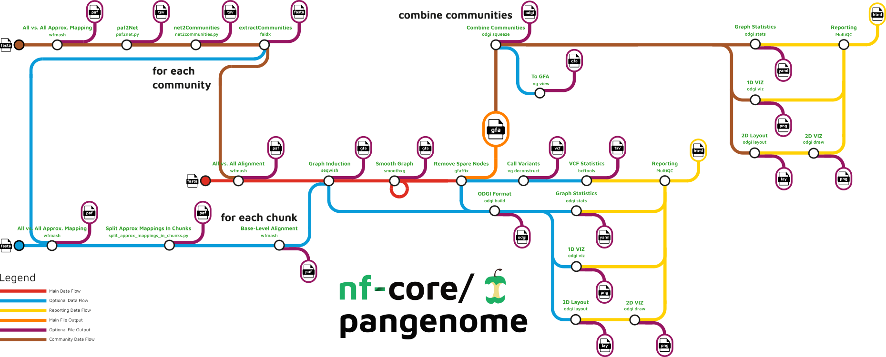

## Learning objectives

In this tutorial we will aim to:

-   construct a simple variation graph with vg

-   undrstand a gfa file format

-   construct a more complex graph with PGGB

-   test multiple different PGGB parameters and understand their effects on the pangenome graph structure

-   evaluate quality of the graph using a few metrics

## 1. Constructing a graph using vg

In this exercise we will construct a tiny pangenome variation graph with vg construct. vg is a tool suite for working with variation graphs. It is very useful for a variety of functions e.g. variant calling from pangenome graphs or mapping short reads to pangenome graphs. Have a look at the [github page](https://github.com/vgteam/vg) for more information.

We will construct a graph from a sequence in fasta file format and then inject a set of variants in a VCF format that will be inserted into the graph as additional nodes.

``` bash
singularity exec pggb_latest.sif vg construct -r tiny.fasta -v tiny.vcf.gz > tiny.vg
```

Lets visualise this graph. Run both of these commands below. The difference between them is only -S.

``` bash
singularity exec pggb_latest.sif vg view -dp tiny.vg | dot -T jpeg -o tiny.sequences.jpeg
singularity exec pggb_latest.sif vg view -dpS tiny.vg | dot -T jpeg -o tiny.sequence_lengths.jpeg
```

### Questions

Ok lets break down what you see - the nodes are sequences, the links connect the sequences. Both the reference sequence and the variants are present in the graph, the top line indicates which nodes make up the reference (tiny.fasta) and the nodes that are not mentioned on that line are the variants.

What is the difference between the two graphs you visualized?

Why are some sequences broken down into separate nodes even though there are no variants between them - how long are these nodes? why do you think that is? To get an idea run and look at the different parameters are the dafults for those parameters:

``` bash
singularity exec pggb_latest.sif vg construct -h
```

::: {.callout-tip collapse="true" icon = "false" appearance="simple"}

### Answers

On one of the graph visualisations all nodes have the actualy sequences displayed, on the other only the length of nodes is displayed.

The -m parameters specifies a limit the maximum allowable node sequence size (default: 32). All nodes are maximum 32bp long.

:::

## 2. GFA file format.

Now lets convert our tiny graph into a gfa file, the type of file format the pggb graph comes in. With the commands below you create and also display the file.

``` bash
singularity exec pggb_latest.sif vg view tiny.vg > tiny.gfa
cat tiny.gfa
```

### Questions

Have a look at the structure of this file. Each line is a separate record of some part of the graph. The lines come in several types, which are indicated by the first character of the line. What line types do you see? What do you think they indicate? Here you will find [GFA](https://github.com/GFA-spec/GFA-spec/blob/master/GFA1.md) files explained.

Lets look at the P line - can you explain the exact structure of this line? What would you expect if you had a pangenome built from several different sequences?

::: {.callout-tip collapse="true" icon = "false" appearance="simple"}

### Answers

You should see the following line types:

-   `H`: a header.

-   `S`: a "sequence" line, which is the sequence and ID of a node in the graph.

-   `L`: a "link" line, which is an edge in the graph.

-   `P`: a "path" line, which labels a path of interest in the graph. In this case, the path is the walk that the reference sequence takes through the graph. It should be noted, however, that the format does not specify that these lines come in a particular order.

If the graph was built from multiple seqeunces, it would have multiple P lines.

:::

## 3. PanGenome Graph Builder

To built a "real" pangenome graph we will now use a subset of sequences from our previous Drosophila dataset. We will be using a 40kb region on chromosome 2L within which there is a gene coding for Alcohol dehydrogenase. Alcohol dehydrogenase is an interesting enzyme whose activity has been show to differ between species that feed of and breed in fermented, rotten fruit (*Drosophila simulans, Drosophila melanogaster*) and species that feed and breed exclusively on ripe fruit (*Drosophila suzuki*).

First lets have a look at the parameters that one can specify with pggb for building a pangenome graph:

``` bash
singularity exec pggb_latest.sif pggb -h
```

Lets pay attention to a few of them.

So to recall pggb runs the following steps:



Look at the red line - the first step is an all-to-all alignment with wfmash. Secondly there is a graph inductions with seqwish and the final step performed with smoothxg which linearizes and simplifies the variation graphs using blocked partial order alignment (POA). Lets focus on these three steps.

A. Two parameters are essential for defining the structure of the pangenome and are implemented in the first step (wfmash all-to-all mapping):

--segment-length - default 5kb

--map-pct-id - default 0.90 or 90%

Segment length defines the length of the mapped and aligned segments, provides a kind of minimum alignment length filter. The mashmap step in wfmash will only consider segments of this size, and require them to have an approximate pairwise identity of at least --map-pct-id.

B. Next you have a set of parameters defined at the step of graph induction which is done with seqwish.

--min-match-len - which is set by default to 23

The min-match-len sets a filter for exact matches below this length during graph induction. The default setting of -k 23 is optimal up to around 5% divergence, and the authors suggest lowering it for higher divergence and increasing it for lower divergence. E.g. values up to -k 79 work well for human haplotypes. In effect, setting -k to N means that we can tolerate a local pairwise difference rate of no more than 1/N.

C. Finally you have a set of parameters defined at the step run with smoothxg:

--poa-length-target - it specifies the target sequence length for POA. The default is 700,1100 which means two rounds of normalization are performed first using target length of 700bp and next of 1100bp.

--n-haplotypes - number of haplotypes you expect from the graph

D. Then you have a set of parameters where you can specify what you want as the output:

--skip-viz - don't render visualizations of the graph in 1D and 2D \[default: make them\]

-S, --stats - generate statistics of the seqwish and smoothxg graph \[default: off\]

-m, --multiqc - generate MultiQC report of graphs' statistics and visualizations, automatically runs odgi stats \[default: off\]

Now we are ready to build our own graph. Lets start with everything set to default but include -S for printing graph statistics.

``` bash
singularity exec pggb_latest.sif pggb -i data/Adh_Drosophila/chr2L_Adh.fasta -n 4 -t 16 -o Adh_pggb_default -S
```

Lets start filling out the following table - best if you create an excel table of your own and start filling it out on your own computer:

| Run | Segment Length | Pairwise identity | Minimum match length | POA Length target | Length of the graph | Number of nodes | Number of edges |
|---------|---------|---------|---------|---------|---------|---------|---------|
| 1 | 5000 | 90 | 23 | 700,1100 |  |  |  |

: PGGB runs results

::: {.callout-tip collapse="true" icon = "false" appearance="simple"}

### Answers

| Run | Segment Length | Pairwise identity | Minimum match length | POA Length target | Length of the graph | Number of nodes | Number of edges |
|---------|---------|---------|---------|---------|---------|---------|---------|
| 1 | 5000 | 90 | 23 | 700,1100 | 89108 | 11109 | 15263 |

: PGGB runs results

:::

So we know from our previous analysis that *Drosophila suzuki* differs from other species by a lot more than 10%. Perhaps that has an influence on the alignment in this genomic region.

Lets change the pairwise identity to 60%.

``` bash
singularity exec pggb_latest.sif pggb -i data/Adh_Drosophila/chr2L_Adh.fasta --map-pct-id 0.6 -n 4 -t 16 -o Adh_pggb_p60 -S
```

What do you observe? What is your conclusion - should we stick with 60% of go with 90%?

| Run | Segment Length | Pairwise identity | Minimum match length | POA Length target | Length of the graph | Number of nodes | Number of edges |
|---------|---------|---------|---------|---------|---------|---------|---------|
| 1 | 5000 | 60 | 23 | 700,1100 |  |  |  |

::: {.callout-tip collapse="true" icon = "false" appearance="simple"}

### Answers

| Run | Segment Length | Pairwise identity | Minimum match length | POA Length target | Length of the graph | Number of nodes | Number of edges |
|---------|---------|---------|---------|---------|---------|---------|---------|
| 1 | 5000 | 90 | 23 | 700,1100 | 89108 | 11109 | 15263 |
| 2 | 5000 | 60 | 23 | 700,1100 | 89195 | 11104 | 15256 |

: PGGB runs results

The structure of the graph changed minimally, actually the size of the graph increased so it appears the p equals to 90% was already a good choice. Lets stick with that then.

:::

Now lets start changing the segment length, lets test a much smaller segment length of 500bp and then lets go with one twice as much as the default - 10,000bp.

``` bash
singularity exec pggb_latest.sif pggb -i data/Adh_Drosophila/chr2L_Adh.fasta -s 10000 -n 4 -t 16 -o Adh_pggb_s10k -S
```

``` bash
singularity exec pggb_latest.sif pggb -i data/Adh_Drosophila/chr2L_Adh.fasta -s 500 -n 4 -t 16 -o Adh_pggb_s500bp -S
```

Fill out the table! What do you see?

| Run | Segment Length | Pairwise identity | Minimum match length | POA Length target | Length of the graph | Number of nodes | Number of edges |
|---------|---------|---------|---------|---------|---------|---------|---------|
| 1 | 500 | 90 | 23 | 700,1100 |  |  |  |
| 2 | 10000 | 90 | 23 | 700,1100 |  |  |  |

::: {.callout-tip collapse="true" icon = "false" appearance="simple"}

### Answers

| Run | Segment Length | Pairwise identity | Minimum match length | POA Length target | Length of the graph | Number of nodes | Number of edges |
|---------|---------|---------|---------|---------|---------|---------|---------|
| 1 | 5000 | 90 | 23 | 700,1100 | 89108 | 11109 | 15263 |
| 2 | 5000 | 60 | 23 | 700,1100 | 89195 | 11104 | 15256 |
| 3 | 500 | 90 | 23 | 700,1100 | 110125 | 6301 | 8600 |
| 4 | 10000 | 90 | 23 | 700,1100 | 102042 | 10411 | 14259 |

: PGGB runs results

The structure of the graph changed minimally, actually the size of the graph increased so it appears the p equals to 90% was already a good choice. Lets stick with that then.

:::

So far we have just accumulated statistics. Lets look at the visualisations. Have a look at the graph from our third run. Do you notice anything strange?
